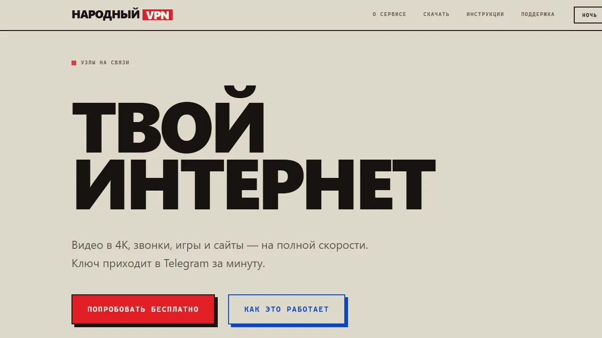
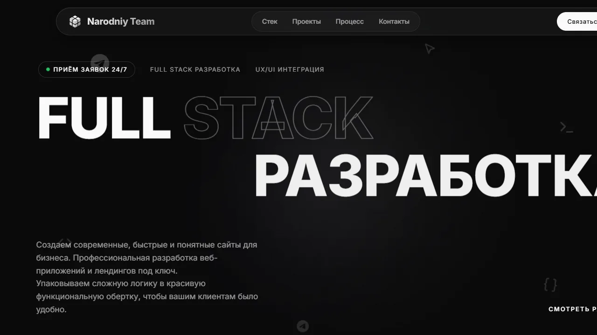
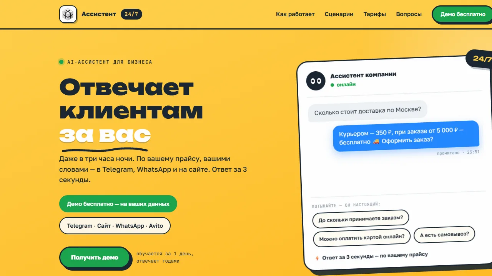
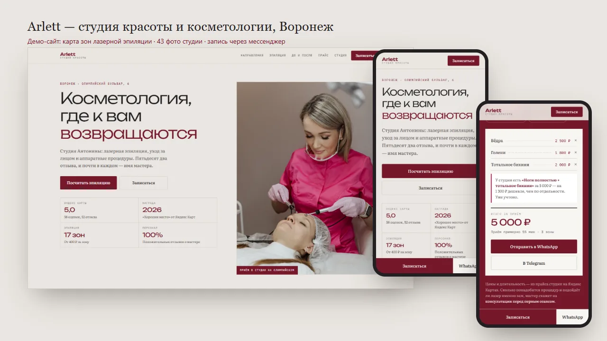
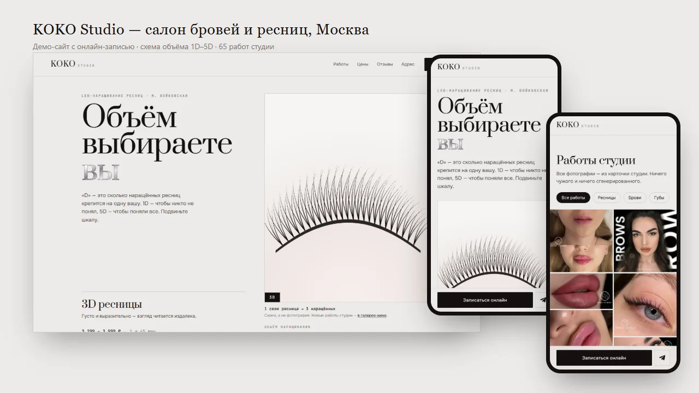
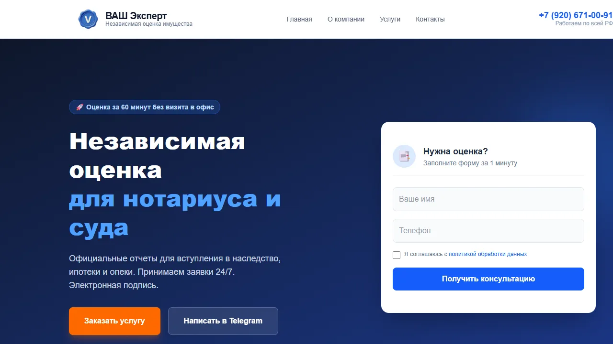
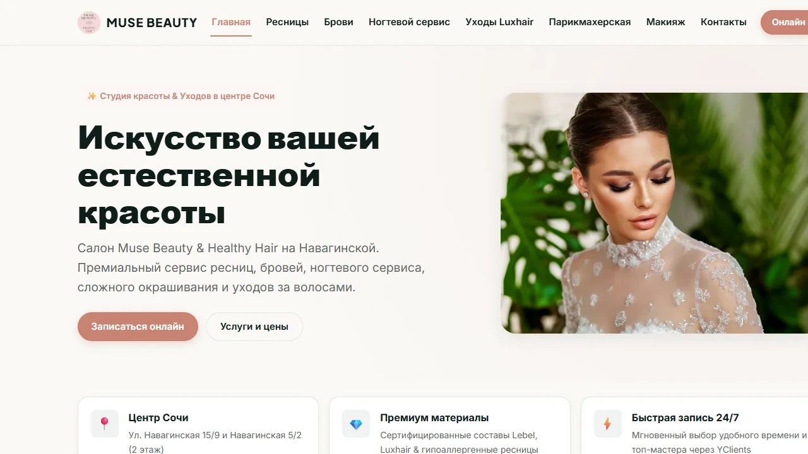

# Буренков М.М. — Full-Stack Developer

Создаю веб-приложения, мобильные приложения и Telegram-боты под ключ, внедряю ИИ и автоматизирую бизнес-процессы.
3 года коммерческого опыта, продукты с живой аудиторией в Google Play. Основатель студии [Narodniy Team](https://narodniy-team.ru).

**Мои сервисы:** [🛡 narodniyvpn.online](https://narodniyvpn.online/) — собственный VPN-сервис · [🤖 narodniy-team.ru/ai](https://narodniy-team.ru/ai/) — AI-ассистент для бизнеса

---

## 🛠 Технологический стек

| Категория | Технологии |
|-----------|-----------|
| **Frontend** | React, Next.js, TypeScript, Tailwind CSS |
| **Mobile** | Flutter, React Native, Dart |
| **Backend** | Node.js, Python (FastAPI, Aiogram), PostgreSQL |
| **AI & автоматизация** | Gemini API, OpenRouter, RAG, Playwright, парсинг данных |
| **Telegram** | Telegram Bot API, Mini-Apps, Web Apps |
| **Инструменты** | Git, Docker, Nginx, Firebase, Figma |

---

## 🚀 Свои продукты

<table>
<tr>
<td width="50%" valign="top">

<h3>Narodniy VPN</h3>

VPN с боевым сервером и живой аудиторией: split-tunneling, маршрутизация Discord, Telegram и YouTube, шифрование лицензий, Telegram Mini-App магазин и платёжный бэкенд. Ключ выдаётся ботом за минуту, без регистрации. Android-клиент на Flutter с нативными каналами к Xray <a href="https://play.google.com/store/apps/details?id=online.narodniyvpn.app">опубликован в Google Play</a>.

<b>Стек:</b> Flutter/Dart, VLESS/Reality (Xray), Electron, FastAPI, PostgreSQL, Telegram Mini-Apps

<a href="https://narodniyvpn.online/">narodniyvpn.online</a> · <a href="https://github.com/bmxer32/NarodniyVPN-PC">клиент Windows</a> · <a href="https://github.com/bmxer32/NarodniyVPN-Android">клиент Android</a>

</td>
<td width="50%" valign="top">

<h3>Narodniy Team — сайт студии</h3>

Продающий сайт студии разработки: анимации, SEO-посадочные под каждую услугу, кастомный интерфейс без конструкторов.

<b>Стек:</b> Next.js 14, React 18, Framer Motion, Lenis, Vercel

<a href="https://narodniy-team.ru">narodniy-team.ru</a> · <a href="https://github.com/bmxer32/narodniy-team">исходники</a>

</td>
</tr>
<tr>
<td width="50%" valign="top">

<h3>AI-ассистент 24/7 — лендинг направления</h3>

Одностраничник услуги, сделанный принципиально «не как у всех»: постерная стикерная эстетика вместо привычных градиентов со стеклянными карточками. Работающее чат-демо в первом экране и калькулятор упущенной выручки. Ноль внешних запросов: шрифты локальные, страница не ходит ни на один сторонний домен.

<b>Стек:</b> ванильные HTML/CSS/JS, Node.js для приёма заявок, nginx

<a href="https://narodniy-team.ru/ai/">narodniy-team.ru/ai</a> · <a href="https://github.com/bmxer32/ai-assistant-landing">исходники</a>

</td>
<td width="50%" valign="top">
&nbsp;
</td>
</tr>
</table>

---

## 💼 Сайты клиентов

Каждый собран на реальных данных заказчика: свои фотографии, свой прайс, свои отзывы.
Никаких стоковых картинок и выдуманных цен.

<table>
<tr>
<td width="50%" valign="top">

<h3>Arlett — студия красоты, Воронеж</h3>

Косметология и лазерная эпиляция. Эпиляция считается по зонам, их семнадцать, и до визита сложить сумму невозможно — поэтому на сайте карта зон: отмечаете участки на схеме, получаете стоимость и время приёма. Комплекты студии подставляются только когда выходят дешевле суммы частей.

Палитра снята замером с их же фотографий: вишнёвый — вывеска, фуксия — форма мастера.

<b>Стек:</b> ванильные HTML/CSS/JS, SVG-схема, GitHub Pages

<a href="https://bmxer32.github.io/arlett-demo/">живой сайт</a> · <a href="https://github.com/bmxer32/arlett-demo">исходники</a>

</td>
<td width="50%" valign="top">

<h3>Atelier Volos — наращивание волос, Сочи</h3>

В наращивании две суммы, и клиентка не знает ни одной: волосы продаются за 100 грамм с ценой по длине среза, а работа считается по прядям. Сайт складывает обе, длина выбирается сантиметровой лентой с настоящей разметкой. Готовый расчёт уходит в WhatsApp одним нажатием.

120 работ студии в галерее с фильтрами и лайтбоксом.

<b>Стек:</b> ванильные HTML/CSS/JS, GitHub Pages

<a href="https://bmxer32.github.io/atelier-volos-demo/">живой сайт</a> · <a href="https://github.com/bmxer32/atelier-volos-demo">исходники</a>

</td>
</tr>
<tr>
<td width="50%" valign="top">

<h3>KOKO Studio — брови и ресницы, Москва</h3>

Шкала объёма 1D–5D на первом экране: «D» — это сколько наращённых ресниц крепится на одну свою, и ползунок рисует ровно это. SVG-схема генерируется на лету, дробный объём чередует. Отвечает на вопрос, который клиентки чаще всего задают в личку.

Онлайн-запись вместо переписки: рабочий YCLIENTS студии открывается в модалке.

<b>Стек:</b> ванильные HTML/CSS/JS, SVG на лету, виджет YCLIENTS

<a href="https://bmxer32.github.io/koko-studio-demo/">живой сайт</a> · <a href="https://github.com/bmxer32/koko-studio-demo">исходники</a>

</td>
<td width="50%" valign="top">

<h3>ВАШ Эксперт — сайт под ключ</h3>

Корпоративный сайт оценочной компании в Иванове: дизайн, разработка, деплой, приём заявок в Telegram, аналитика.

<b>Стек:</b> Next.js 15, React 19, Tailwind CSS v4, Telegram Bot API, Vercel

<a href="https://v-experto.ru">v-experto.ru</a> · <a href="https://github.com/bmxer32/v-experto">исходники</a>

</td>
</tr>
<tr>
<td width="50%" valign="top">

<h3>Мир волос — сайт записи для мастера</h3>

Mobile-first лендинг мастера наращивания волос: онлайн-запись с заявками в Telegram и WhatsApp, галерея работ «до и после», SEO.

<b>Стек:</b> Next.js 15, TypeScript, Tailwind CSS 4, Framer Motion

<a href="https://mirvolos32.ru">mirvolos32.ru</a> · <a href="https://github.com/bmxer32/mirvolos">исходники</a>

</td>
<td width="50%" valign="top">

<h3>Muse Beauty — редизайн сайта салона</h3>

Переделка сайта салона красоты: восемь страниц, собственная вёрстка вместо конструктора, галереи работ по направлениям, мобильное меню.

<b>Стек:</b> ванильные HTML/CSS/JS, GitHub Pages

<a href="https://bmxer32.github.io/musebeauty-redesign/">живой сайт</a> · <a href="https://github.com/bmxer32/musebeauty-redesign">исходники</a>

</td>
</tr>
</table>

---

## 📱 Приложения и инструменты

### [Reko — AI-дневник питания и тренировок](https://github.com/bmxer32/reko)

Flutter-приложение с ИИ-сканером еды на базе Google Gemini.
[Опубликовано в Google Play](https://play.google.com/store/apps/details?id=com.buren.fitness_app).
Offline-first, синхронизация через Firebase, тёмная тема.

**Стек:** Flutter, Riverpod, Drift, Firebase, Gemini API, OpenFoodFacts

### [Yandex Maps Scraper — десктоп-приложение для сбора данных](https://github.com/bmxer32/yandex-maps-scraper)

Windows-приложение с установщиком, которое собирает базу организаций с Яндекс Карт:
сфера, адрес, телефон, координаты, рейтинг, часы работы, сайт, соцсети и email.

- **Географический каскад** — страна → область → город → район или метро, с полными списками для Москвы и Санкт-Петербурга.
- **Два прохода** — сначала карточки организаций за сайтами и соцсетями, затем обход самих сайтов за email.
- **Антидетект** — маскировка headless Chromium, рандомизация профиля браузера, «человеческие» задержки, поддержка прокси.
- **Прогресс в реальном времени** через Server-Sent Events, фильтры и сортировка в таблице, экспорт в Excel и CSV.

**Стек:** Python, FastAPI, Playwright, SQLAlchemy/SQLite, Next.js 15, React 19, Electron

### [MegaBot — RSS → AI → Telegram](https://github.com/bmxer32/RSS-tg-bot)

Бот автоматизации ведения каналов: собирает материалы из RSS-лент, обрабатывает через AI
(перевод, форматирование, эмодзи и хештеги) и публикует по расписанию.

**Стек:** Python, Aiogram 3, SQLAlchemy 2.0, APScheduler

---

## 🤖 ИИ и автоматизация

Отдельное направление студии: беру рутину, которую в компании делают руками,
и превращаю её в сервис, который работает сам.

- **AI-ассистенты для клиентского сервиса** — отвечают в Telegram, WhatsApp, на сайте и Avito круглосуточно, по загруженному прайсу и базе знаний компании. Записывают в календарь, принимают заказы, эскалируют сложные вопросы менеджеру и присылают отчёт по диалогам за сутки.
- **Автоматизация контента** — сбор из RSS и других источников, AI-обработка и публикация по расписанию без участия человека.
- **Сбор и обогащение данных** — парсеры на Playwright с антидетектом, второй проход по сайтам компаний за email и соцсетями, выгрузка в Excel и CSV для отдела продаж.
- **Интеграции** — приём заявок в Telegram, вебхуки платёжных систем, CRM, Яндекс Метрика и цели по воронке.

Подробнее и с расчётом окупаемости: **[narodniy-team.ru/ai](https://narodniy-team.ru/ai/)**

---

## 📞 Контакты

| | |
|---|---|
| **Telegram** | [@webe9](https://t.me/webe9) |
| **Сайт студии** | [narodniy-team.ru](https://narodniy-team.ru) |
| **AI-ассистент** | [narodniy-team.ru/ai](https://narodniy-team.ru/ai/) |
| **VPN-сервис** | [narodniyvpn.online](https://narodniyvpn.online/) |
| **Email** | [v71072587@gmail.com](mailto:v71072587@gmail.com) |

---

  

